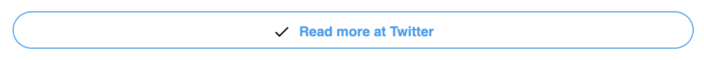
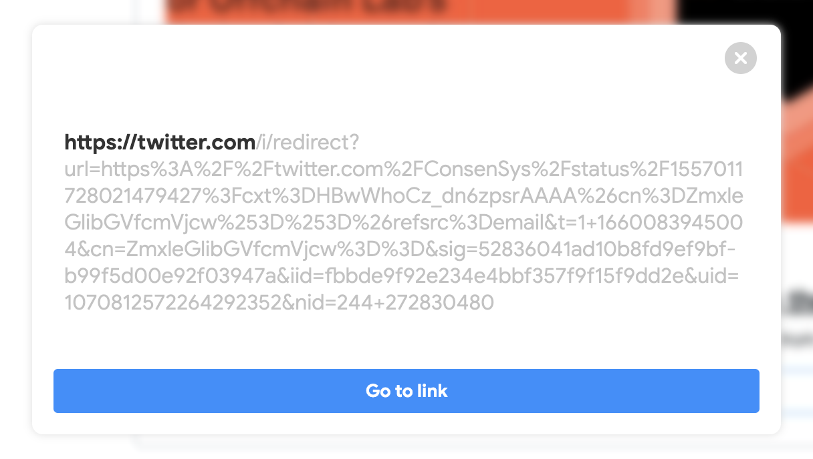

# PhishMeNot

PhishMeNot is a chrome extension that scans all the links in your email and hijacks any clicks on them to stop the user from going directly to the link.

Instead the user sees a dialog prompt displaying the actual url of the link.

If the link looks suspicious the user should not proceed to the webpage. If it looks ok the user can click the "Go to link" button in the prompt which will open the link as normal.
